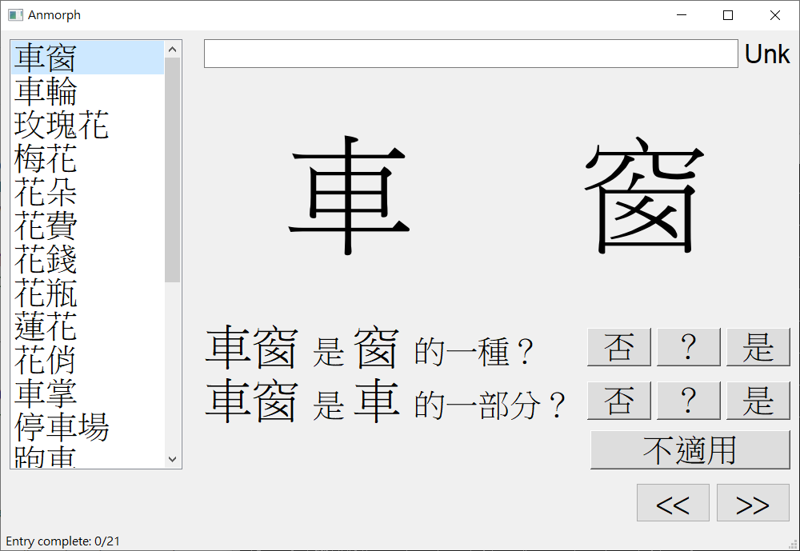
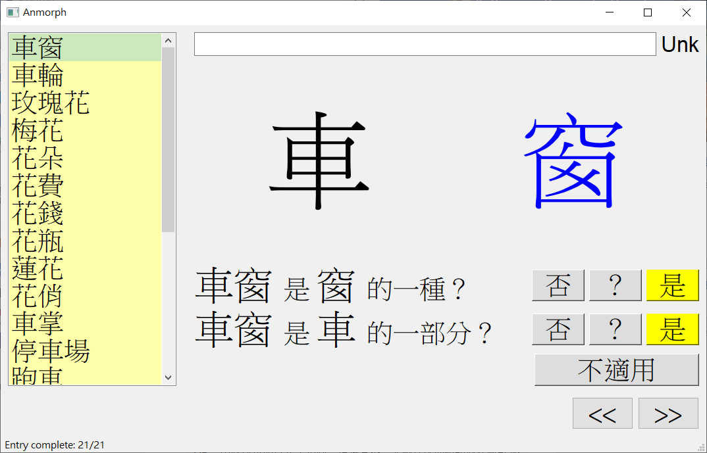

# Anmorph

_An_notation on _Morph_ology

## Requirement
* Python3
* pySide2

## Installation/Usage

1. clone the project
```
git clone https://github.com/seantyh/GWA2019
```

2. install pySide2 (for Qt)
```
pip3 install pyside2
```

3. prepare a wordlist (there is one in data/word_list.0.csv)
wordlist只是一個用UTF-8編碼，以斷行分隔的詞表。Anmorph讀入檔案後，會將這個詞表檔案覆蓋為一個逗號分隔的資料表。所以在這一步要先把詞表複製成另外一個檔案。
```
cp word_list.0.csv word_list.csv
```

4. start anmorph
```
python3 anmorph.py data/word_list.csv
```


## Anmorph GUI



* Anmorph的主畫面分成兩大塊，左邊是詞表，右邊是輸入介面。
* 右邊的輸入介面的目的是要讓使用者輸入三件事情：
  1. 這個詞的次單位：Unit1和Unit2
  2. 整個詞是不是Unit1的一種？（hypernymy heuristics）
  3. 整個詞是不是Unit2的一部份？（meronymy heuristics）
* 程式會先將一個詞的最後一個字當作Unit1。但使用者可以直接點選一個字，被點選的字會被視為Unit1。「其他的字」（即便不相鄰）會被視為Unit2。
* 當Unit1、Unit2決定之後，下方的兩個問句會自動更新，使用者以按鈕回答是、否或？（代表不適用）。
* 如果整個詞被拆成Unit1、和Unit2不合理，則可直接按「不適用」，程式會自動當作上述兩個問題的答案皆為「不適用」。
* 最上方的空白文字方塊是做筆記用。文字方塊的內容會寫在輸出資料表的最後一欄（note欄位）。
* 全部回答完成後，就用「>>」到下一個詞。程式會在這時候自動儲存目前的資料。儲存的資料格式不是原來的詞表，而是一個有多個欄位的資料表（如以下Output CSV範例）。
* 在左方清單中，一個已完成的詞條會以淡黃色背景顯示。同時下方也會顯示目前完成的詞條數和總數。  
  已完成的詞條必須符合下列條件之一：
  1. 兩個問題都有答案（是、否或「？」）
  2. 使用者僅勾選「不適用」

## Output CSV
```
serial,lemma,pos,unit1,unit2,hyper_rule,mero_rule,na_rule,unit1_syn,unit2_syn,note
0,車窗,N,窗,車,1,1,-1,,,
1,車輪,N,輪,車,1,1,-1,,,
2,玫瑰花,N,花,玫瑰,1,1,-1,,,
3,梅花,N,花,梅,1,1,-1,,,
4,花朵,N,朵,花,-1,1,-1,,,朵？
5,花費,V,費,花,-1,-1,1,,,
```

## Screenshot when all words are finished
